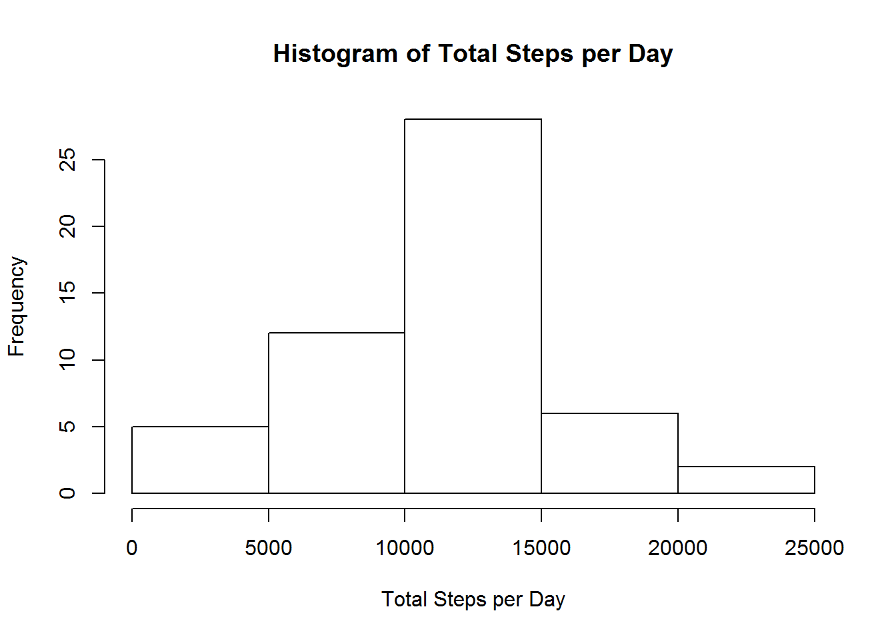

```r
knitr::opts_chunk$set(fig.path='Figs/')
```

## Loading and preprocessing the data

First, we need to load the data. The code below assumes you have downloaded the data file into your R working directory.The data is available for download from this website: https://d396qusza40orc.cloudfront.net/repdata%2Fdata%2Factivity.zip


```r
activity <- read.csv("activity.csv", header=T, stringsAsFactor=F)
```

After loading the data, we can look at a summary of the data. 


```r
summary(activity)
```

```
##      steps            date              interval     
##  Min.   :  0.00   Length:17568       Min.   :   0.0  
##  1st Qu.:  0.00   Class :character   1st Qu.: 588.8  
##  Median :  0.00   Mode  :character   Median :1177.5  
##  Mean   : 37.38                      Mean   :1177.5  
##  3rd Qu.: 12.00                      3rd Qu.:1766.2  
##  Max.   :806.00                      Max.   :2355.0  
##  NA's   :2304
```

The date data is not in the proper format, so now we change it from characters to dates. 


```r
activity$date <- as.Date(activity$date)
```

## What is mean total number of steps taken per day?

First, we want to calculate the total number of steps taken, per day. We can do this using the "plyr" package in R. 


```r
library(plyr)
stepsday <- ddply(activity, "date", summarize, totsteps = sum(steps))
stepsday
```

```
##          date totsteps
## 1  2012-10-01       NA
## 2  2012-10-02      126
## 3  2012-10-03    11352
## 4  2012-10-04    12116
## 5  2012-10-05    13294
## 6  2012-10-06    15420
## 7  2012-10-07    11015
## 8  2012-10-08       NA
## 9  2012-10-09    12811
## 10 2012-10-10     9900
## 11 2012-10-11    10304
## 12 2012-10-12    17382
## 13 2012-10-13    12426
## 14 2012-10-14    15098
## 15 2012-10-15    10139
## 16 2012-10-16    15084
## 17 2012-10-17    13452
## 18 2012-10-18    10056
## 19 2012-10-19    11829
## 20 2012-10-20    10395
## 21 2012-10-21     8821
## 22 2012-10-22    13460
## 23 2012-10-23     8918
## 24 2012-10-24     8355
## 25 2012-10-25     2492
## 26 2012-10-26     6778
## 27 2012-10-27    10119
## 28 2012-10-28    11458
## 29 2012-10-29     5018
## 30 2012-10-30     9819
## 31 2012-10-31    15414
## 32 2012-11-01       NA
## 33 2012-11-02    10600
## 34 2012-11-03    10571
## 35 2012-11-04       NA
## 36 2012-11-05    10439
## 37 2012-11-06     8334
## 38 2012-11-07    12883
## 39 2012-11-08     3219
## 40 2012-11-09       NA
## 41 2012-11-10       NA
## 42 2012-11-11    12608
## 43 2012-11-12    10765
## 44 2012-11-13     7336
## 45 2012-11-14       NA
## 46 2012-11-15       41
## 47 2012-11-16     5441
## 48 2012-11-17    14339
## 49 2012-11-18    15110
## 50 2012-11-19     8841
## 51 2012-11-20     4472
## 52 2012-11-21    12787
## 53 2012-11-22    20427
## 54 2012-11-23    21194
## 55 2012-11-24    14478
## 56 2012-11-25    11834
## 57 2012-11-26    11162
## 58 2012-11-27    13646
## 59 2012-11-28    10183
## 60 2012-11-29     7047
## 61 2012-11-30       NA
```
The "stepsday" object now has the total number of steps per day. 

We can plot these values in a histogram.


```r
hist(stepsday$totsteps, main="Histogram of Total Steps per Day",xlab="Total Steps per Day")
```

 

Next we can easily calculate the mean and median number of steps taken per day, excluding any missing data (NAs).


```r
mean(stepsday$totsteps, na.rm=T)
```

```
## [1] 10766.19
```

```r
median(stepsday$totsteps, na.rm=T)
```

```
## [1] 10765
```

## What is the average daily activity pattern?

Next, we want to make a time series plot of the 5-minute interval (x-axis) and the average number of steps taken, averaged across all days (y-axis). To do this, we first need to calculate the average number of steps per interval, again using the "plyr" package. I print out only the first 10 rows of this averaged dataset.


```r
stepsint <- ddply(activity, "interval", summarize, totsteps = sum(steps, na.rm=T))
stepsint[1:10,]
```

```
##    interval totsteps
## 1         0       91
## 2         5       18
## 3        10        7
## 4        15        8
## 5        20        4
## 6        25      111
## 7        30       28
## 8        35       46
## 9        40        0
## 10       45       78
```

Next, we can use this data to make the plot. 


```r
plot(stepsint$interval, stepsint$totsteps, type="l", main="Time Series Plot of Average number of Steps \n Taken Per Interval, Averaged across Days", ylab="Total Number of Steps", xlab="Five Minute Intervals")
```

 

Next, we can see which interval has the highest average number of steps. 


```r
subset(stepsint[which(stepsint$totsteps==max(stepsint$totsteps)),])
```

```
##     interval totsteps
## 104      835    10927
```

The maximum average total steps was 10,927, and this is from the 835th interval. 

## Imputing missing values

To assess impact of missing values, first, we need to calculate the total number of missing values. 


```r
anoNAs <- na.omit(activity)
length(activity$date)-length(anoNAs$date)
```

```
## [1] 2304
```

So there are over 2000 missing valules, out of over 17,000. Now, we will perform a simple method for filling in that missing data. There are several better options for doing so in a non-exploratory analysis, but for now, we are simply going to fill in the mean for the interval.

First, we need to calculate the mean for each interval. Then, we need to fill those values in for the missing values in a new dataset, "activity2" 


```r
meansteps <- ddply(activity, "interval", summarize, meansteps = mean(steps, na.rm=T))
activity2 <- merge(activity,meansteps,by="interval")
activity2$steps <- ifelse(!is.na(activity2$steps), activity2$steps, activity2$meansteps)
```

The "steps" variable in the "activity2" dataset now has no missing values. 

Next, we make another histogram of steps per day, and calculate the mean and median again, this time without missing values, to see if the missing data had any affect on our original estimates. To do this, we repeate the earlier analyses, but on our new dataset. 


```r
stepsday2 <- ddply(activity2, "date", summarize, totsteps = sum(steps))
hist(stepsday2$totsteps, main="Histogram of Total Steps per Day,\n without Missing Data",xlab="Total Steps per Day")
```

 

```r
mean(stepsday2$totsteps)
```

```
## [1] 10766.19
```

```r
median(stepsday2$totstep)
```

```
## [1] 10766.19
```

We see that the mean is unaffected by the missing data, but the median is affected a very small amount. 

## Are there differences in activity patterns between weekdays and weekends?

To assess differences between weekdays and weekends, first we have to create a variable that distinguishes between these. First, we can use the weekdays() function to specify what day of the week observations were taken, then we can transform that variable into a dummy coded variable for weekdays vs. weekends. 


```r
activity2$date <- as.Date(activity2$date)
activity2$day <- weekdays(activity2$date)
activity2$weekend <- ifelse(activity2$day=="Saturday"|activity2$day=="Sunday",activity2$weekend <- 1,activity2$weekend <- 0)
```

Lastly, we need to make a panel plot containing a time series plot (i.e. type = "l") of the 5-minute interval (x-axis) and the average number of steps taken, averaged across all weekday days or weekend days (y-axis). 

First, we need to create the data to plot. 


```r
stepsint2 <- ddply(activity2, .(interval,weekend), summarize, totsteps = sum(steps, na.rm=T))
```

Then, we can make a panel plot, using the "lattice" package in R. 


```r
library(lattice)
xyplot(stepsint2$totsteps~stepsint2$interval|factor(stepsint2$weekend, levels=c(0,1), labels=c("Weekday","Weekend")), type="l",
          main="Time Series Plot of Average Steps per Interval, \n Averaged Across Weekdays and Weekends", 
   ylab="Total Average Steps", xlab="Intervals")
```

 

This shows us clearly that more people are taking, on average, more steps on weekdays than weekends. 
